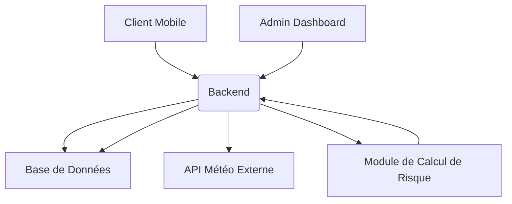

# Rapport Technique - MBOYY MII Alert

## 1. Introduction

Ce rapport technique détaille l'architecture, les technologies utilisées, les fonctionnalités implémentées et les aspects techniques du projet MBOYY MII Alert. L'objectif principal de cette plateforme est d'alerter les populations du Sénégal, en particulier les plus vulnérables, des risques sanitaires liés aux vagues de chaleur et de proposer des gestes préventifs personnalisés.

## 2. Architecture Générale

Le système MBOYY MII Alert est conçu selon une architecture client-serveur, avec un backend robuste en Node.js et des interfaces utilisateur développées en React.js pour l'administration et les clients mobiles. La communication entre les composants est assurée par des APIs RESTful.

### 2.1. Schéma Architectural

### 2.2. Composants Clés

- **Backend (Node.js/Express.js)** : Cœur de l'application, gère la logique métier, l'authentification, l'accès aux données et l'intégration avec les services externes.
- **Base de Données (MySQL)** : Stocke les informations utilisateurs, les profils, les données météorologiques historiques, les alertes et les rapports.
- **Frontend Admin (React.js)** : Interface web dédiée aux administrateurs pour la gestion du système, le suivi des données et la configuration.
- **Frontend Client (React.js)** : Application mobile-first pour les utilisateurs finaux, affichant les alertes, les données météo et les recommandations personnalisées.
- **API Météo Externe (Open-Meteo)** : Fournit les données météorologiques en temps réel.

## 3. Technologies Utilisées

### 3.1. Backend

- **Node.js** : Environnement d'exécution JavaScript côté serveur, choisi pour sa performance et son écosystème riche.
- **Express.js** : Framework web minimaliste et flexible pour Node.js, facilitant la création d'APIs RESTful.
- **Sequelize** : ORM (Object-Relational Mapper) pour Node.js, permettant une interaction simplifiée avec la base de données MySQL via des objets JavaScript.
- **MySQL2** : Driver MySQL pour Node.js, offrant des performances améliorées.
- **bcrypt.js** : Bibliothèque pour le hachage sécurisé des mots de passe.
- **jsonwebtoken (JWT)** : Pour la création et la vérification des tokens d'authentification.
- **axios** : Client HTTP basé sur les promesses pour effectuer des requêtes vers l'API Open-Meteo.

### 3.2. Frontend

- **React.js** : Bibliothèque JavaScript pour la construction d'interfaces utilisateur interactives, choisie pour sa modularité et sa performance.
- **Vite** : Outil de build rapide pour le développement frontend.
- **Tailwind CSS** : Framework CSS utilitaire pour un stylisme rapide et réactif.
- **React Router DOM** : Pour la gestion de la navigation et des routes dans les applications React.
- **Context API (React)** : Pour la gestion de l'état global, notamment l'authentification.
- **Lucide React** : Bibliothèque d'icônes pour une interface utilisateur moderne.

### 3.3. Base de Données

- **MySQL** : Système de gestion de base de données relationnelle open-source, fiable et performant.

## 4. Fonctionnalités Techniques Détaillées

### 4.1. Gestion des Utilisateurs et Authentification

- **Modèles `User` et `Profile`** : Définis avec Sequelize, `User` gère les informations de connexion (email, mot de passe, rôle) et `Profile` stocke les détails spécifiques (âge, conditions de vulnérabilité).
- **Hachage des Mots de Passe** : Utilisation de `bcrypt.js` pour hacher les mots de passe avant de les stocker, garantissant la sécurité.
- **Authentification JWT** : Lors de la connexion, un token JWT est généré et renvoyé au client. Ce token est ensuite utilisé pour authentifier les requêtes ultérieures, assurant la sécurité des endpoints protégés.
- **Rôles (Admin/Client)** : Implémentation de rôles pour différencier les accès et les fonctionnalités disponibles pour les administrateurs et les utilisateurs finaux.

### 4.2. Intégration API Météo (Open-Meteo)

- **Service `weatherService.js`** : Module dédié à l'interaction avec l'API Open-Meteo. Il gère les requêtes HTTP et le traitement initial des données météorologiques.
- **Données Récupérées** : Température (actuelle, apparente, min/max), humidité, vitesse et direction du vent, code météo. Ces données sont cruciales pour l'évaluation du risque.
- **Couverture Géographique** : L'API est configurée pour récupérer les données pour 12 villes principales du Sénégal (Dakar, Saint-Louis, Thiès, Kaolack, Ziguinchor, Diourbel, Tambacounda, Matam, Podor, Kaffrine, Kolda, Louga).

### 4.3. Module de Calcul de Risque de Chaleur

- **Logique de Calcul** : Basée sur la température apparente (ressentie), le système classe le risque en plusieurs niveaux :
    - **Normal** (< 30°C)
    - **Inconfortable** (30-35°C)
    - **Très Inconfortable** (35-40°C)
    - **Dangereux** (> 40°C)
- **Recommandations Personnalisées** : Chaque niveau de risque est associé à un ensemble de recommandations spécifiques (ex: 

    "Buvez suffisamment d'eau", "Évitez l'exposition prolongée au soleil").
- **Persistance des Données** : Les données météorologiques et les niveaux de risque calculés sont stockés dans la table `weather_data` pour l'historique et l'analyse.

### 4.4. Système d'Alertes

- **Modèle `Alert`** : Permet de stocker les informations sur les alertes générées, y compris le niveau de vigilance, le message et la zone concernée.
- **Génération Automatique** : Les alertes peuvent être déclenchées automatiquement lorsque les conditions météorologiques atteignent certains seuils de risque.
- **Gestion Manuelle** : Les administrateurs peuvent créer, modifier et supprimer des alertes via le tableau de bord.

### 4.5. Collecte de Données Terrain (Rapports)

- **Modèle `Report`** : Conçu pour collecter des données soumises par les utilisateurs terrain (citoyens, agents de santé) concernant les effets sanitaires des vagues de chaleur (symptômes, ressentis thermiques, conditions environnementales).
- **API de Soumission** : Un endpoint API est disponible pour permettre la soumission sécurisée de ces rapports.

## 5. Interfaces Utilisateur

### 5.1. Admin Dashboard (Web)

- **Technologies** : React.js, Tailwind CSS, React Router DOM.
- **Fonctionnalités** :
    - **Tableau de Bord** : Vue d'ensemble des statistiques clés (utilisateurs, alertes, données météo).
    - **Gestion des Utilisateurs** : CRUD (Créer, Lire, Mettre à jour, Supprimer) des comptes utilisateurs (admin et client).
    - **Gestion des Alertes** : Visualisation des alertes actives et historiques, création de nouvelles alertes.
    - **Données Météo** : Affichage détaillé des données météorologiques par ville, avec possibilité de filtrage.
    - **Rapports** : Consultation des rapports soumis par les utilisateurs terrain.
    - **Paramètres** : Configuration des seuils de risque, gestion des zones de vigilance.
- **Design** : Interface moderne, intuitive et responsive, optimisée pour les écrans d'ordinateur.

### 5.2. Client Mobile (Mobile-First)

- **Technologies** : React.js, Tailwind CSS, React Router DOM.
- **Fonctionnalités** :
    - **Accueil** : Affichage des données météo actuelles pour la ville sélectionnée, niveau de risque et recommandations.
    - **Sélecteur de Ville** : Permet à l'utilisateur de choisir parmi les 12 villes du Sénégal pour obtenir des informations localisées.
    - **Profil Utilisateur** : Permet de spécifier le profil de vulnérabilité (personne âgée, femme enceinte, enfant, maladie chronique) pour des recommandations ciblées.
    - **Module "Que faire ?"** : Conseils d'hydratation, d'habillage, de ventilation, gestes de premiers secours et bouton d'urgence.
    - **Signalement** : Formulaire pour soumettre des rapports sur les symptômes observés et les conditions environnementales.
    - **Alertes** : Affichage des alertes actives pertinentes pour la localisation de l'utilisateur.
- **Design** : Interface épurée, mobile-first, avec une navigation facile et des icônes claires.

## 6. API Endpoints

### 6.1. Authentification
- `POST /api/auth/register` : Inscription d'un nouvel utilisateur.
- `POST /api/auth/login` : Connexion d'un utilisateur et obtention d'un token JWT.

### 6.2. Utilisateurs
- `GET /api/users` : Récupère la liste de tous les utilisateurs (Admin).
- `GET /api/users/:id` : Récupère les détails d'un utilisateur spécifique (Admin).
- `PUT /api/users/:id` : Met à jour les informations d'un utilisateur (Admin).
- `DELETE /api/users/:id` : Supprime un utilisateur (Admin).

### 6.3. Météo
- `GET /api/weather/current/:city` : Récupère les données météorologiques actuelles pour une ville donnée.
- `GET /api/weather/all-cities` : Récupère les données météorologiques actuelles pour toutes les villes supportées.
- `GET /api/weather/cities` : Récupère la liste des villes supportées.
- `GET /api/weather/alerts/active` : Récupère les alertes météo actives.

### 6.4. Rapports
- `POST /api/reports` : Soumet un nouveau rapport de données terrain.
- `GET /api/reports` : Récupère tous les rapports (Admin).

## 7. Base de Données (MySQL)

### 7.1. Schéma des Tables

- **`users`** :
    - `id` (PK, INT, Auto-increment)
    - `username` (VARCHAR)
    - `email` (VARCHAR, UNIQUE)
    - `password` (VARCHAR)
    - `role` (ENUM: 'admin', 'client')
    - `isActive` (BOOLEAN)
    - `createdAt` (DATETIME)
    - `updatedAt` (DATETIME)

- **`profiles`** :
    - `id` (PK, INT, Auto-increment)
    - `userId` (FK to `users.id`, INT, UNIQUE)
    - `age` (INT)
    - `vulnerability` (ENUM: 'personne_agee', 'femme_enceinte', 'enfant', 'maladie_chronique', 'aucun')
    - `location` (VARCHAR)
    - `createdAt` (DATETIME)
    - `updatedAt` (DATETIME)

- **`weather_data`** :
    - `id` (PK, INT, Auto-increment)
    - `city` (VARCHAR)
    - `region` (VARCHAR)
    - `latitude` (DECIMAL)
    - `longitude` (DECIMAL)
    - `temperature` (DECIMAL)
    - `humidity` (INT)
    - `apparentTemperature` (DECIMAL)
    - `weatherCode` (INT)
    - `weatherDescription` (VARCHAR)
    - `windSpeed` (DECIMAL)
    - `windDirection` (INT)
    - `heatRiskLevel` (VARCHAR)
    - `timestamp` (DATETIME)
    - `createdAt` (DATETIME)
    - `updatedAt` (DATETIME)

- **`alerts`** :
    - `id` (PK, INT, Auto-increment)
    - `title` (VARCHAR)
    - `message` (TEXT)
    - `level` (ENUM: 'normal', 'inconfortable', 'très_inconfortable', 'dangereux', 'très_dangereux')
    - `city` (VARCHAR)
    - `region` (VARCHAR)
    - `isActive` (BOOLEAN)
    - `createdAt` (DATETIME)
    - `updatedAt` (DATETIME)

- **`reports`** :
    - `id` (PK, INT, Auto-increment)
    - `userId` (FK to `users.id`, INT)
    - `symptoms` (TEXT)
    - `environmentalConditions` (TEXT)
    - `thermalSensation` (VARCHAR)
    - `location` (VARCHAR)
    - `createdAt` (DATETIME)
    - `updatedAt` (DATETIME)

### 7.2. Synchronisation Automatique

La base de données et toutes les tables sont automatiquement créées et synchronisées au démarrage du serveur backend grâce à Sequelize, ce qui simplifie la configuration et le déploiement.

## 8. Déploiement et Exécution

### 8.1. Environnement de Développement

Les instructions détaillées pour l'installation des prérequis (Node.js, MySQL) et le démarrage des services (backend, admin, client) sont fournies dans le `README.md` du projet.

### 8.2. Considérations de Production

Pour un déploiement en production, il serait nécessaire de :
- Configurer un serveur web (Nginx, Apache) pour servir les applications frontend statiques.
- Utiliser un processus manager (PM2) pour le backend Node.js afin d'assurer la haute disponibilité.
- Mettre en place un certificat SSL/TLS pour les communications HTTPS.
- Configurer un pare-feu et des règles de sécurité réseau.
- Mettre en place une solution de monitoring et de logging centralisée.

## 9. Conclusion

Le projet MBOYY MII Alert est une plateforme robuste et fonctionnelle, développée avec des technologies modernes et des pratiques de développement solides. Il répond aux exigences initiales de fournir un système d'alerte et de prévention des vagues de chaleur au Sénégal, avec des interfaces utilisateur intuitives et une intégration de données météorologiques réelles. Les bases sont posées pour de futures évolutions, notamment l'intégration de l'IA et le support multilingue avancé.

---

